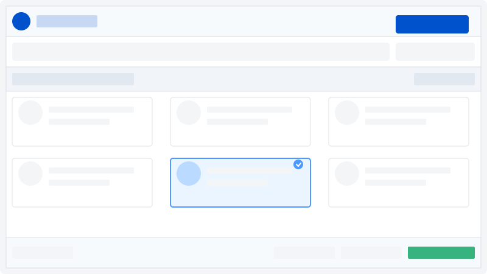

# Assynaid - Modern Jira Assignee Scanner

A beautiful Chrome extension that scans and manages Jira board assignees with a modern UI and powerful features.



## Features

- **Beautiful UI**: Modern, responsive interface built with Svelte, TypeScript and TailwindCSS
- **Scan Assignees**: Quickly extract all assignees from a Jira board with one click
- **Multiple Views**: Switch between grid, list, and group views
- **Assignee Selection**: Select assignees in the extension and apply to Jira board
- **Group Management**: Create, edit and delete custom groups of assignees
- **Search**: Easily filter assignees by name or role
- **Dark Mode**: Toggle between light and dark themes
- **Export Options**: Copy to clipboard or export to CSV
- **Smooth Animations**: Beautiful transitions and animations

## Technology Stack

- **Svelte & TypeScript**: For component-based, type-safe UI
- **TailwindCSS**: For responsive, utility-first styling
- **Vite**: For modern, fast build tooling
- **shadcn-svelte**: For beautiful UI components
- **Lucide Icons**: For consistent, customizable iconography
- **Chrome Extension API**: For browser integration

## Development

### Prerequisites

- Node.js (v16 or higher)
- npm or yarn

### Installation

1. Clone the repository

   ```bash
   git clone https://github.com/yourusername/assynaid.git
   cd assynaid
   ```

2. Install dependencies

   ```bash
   npm install
   # or
   yarn
   ```

3. Start development server

   ```bash
   npm run dev
   # or
   yarn dev
   ```

4. Build the extension

   ```bash
   npm run build
   # or
   yarn build
   ```

5. Package the extension
   ```bash
   npm run package
   # or
   yarn package
   ```

## Installation in Chrome

1. Build the extension using `npm run build`
2. Open Chrome and go to `chrome://extensions/`
3. Enable "Developer mode" (toggle in the top-right corner)
4. Click "Load unpacked" and select the `dist` directory from the project
5. The extension is now installed and ready to use

## Usage

1. Navigate to any Jira board
2. Click the Assynaid icon in your browser toolbar
3. Click "Scan Now" to extract assignees
4. Select assignees by clicking on them
5. Use the group view to create and manage assignee groups
6. Click "Apply Selection" to select those assignees on the Jira board
7. Export or copy assignee information as needed

## License

MIT

---

Created with ❤️ for Jira users everywhere
